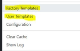
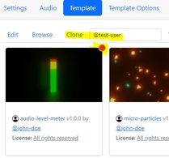
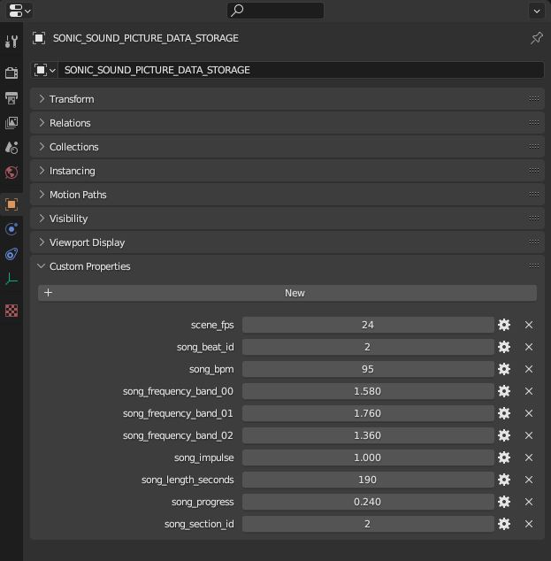
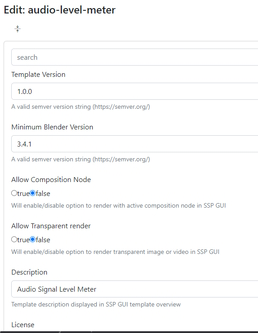
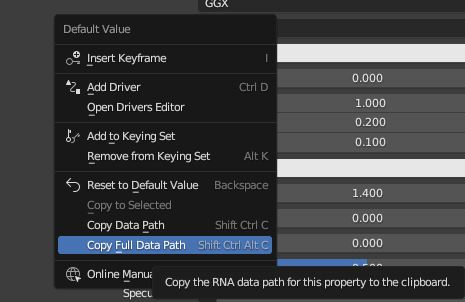

# Create new templates 

If you create and new template your are invited to share it with community or at least a showcase on our discord server. I am very excited to see what a real blender artist could do with this software 🤙. 

## Template locations

Theres exist 2 folders containing templates on the system.

- Factory templates: `<FACTORY_TEMPLATES_DIR>\<template_name>` 
- User templates: `<USER_TEMPLATES_DIR>\@<artist_name>\<template_name>`

You can browse to these `<FACTORY_TEMPLATES_DIR>` and `<USER_TEMPLATES_DIR>` directories using the GUI main menu.  


## Add a new fresh template

To start from scratch click on `Create Template` button in the `Template` tab section with SPP GUI. It creates a template folder with a `.blend` file already contains a pre-configured `empty` `SONIC_SOUND_PICTURE_DATA_STORAGE` which is all you need. There is also a little script inside which will render a thumbnail image once you finished your creator process. Goto Blender' s `Scripting` area and execute the script.

## Clone template files

If you like an existing template you can make a clone and edit the new copy. Since v1.0.18 SSP provides a easy way todo that and provides other useful creator functions. 

1. Select a template you which to clone in the template overview or create a new one from scratch *Be sure you provided a `Template Artist name` before!* 
2. Click `Edit/template.blend` or `Edit/Browse` menu item to continue



## Creator process workflow

1. Adjust your `.blend` file.
2. Render with SPP output type `blender` instead of `video`.
3. Check the result by opening the rendered file and simply play it within blender.
4. Return to step 1 until you are finished and happy with the result.
5. Configure the settings (`template.json`) other users should be able to setup before they use your template to render a video. 

A template folder needs 3 files to be valid. Otherwise it will not show up in GUI' s template overview.

- `template.blend` (Blender template file)
- `template.json` (Template configuration)
- `template.png` (480x270 Template preview for SSP GUI)

## Automation basics

The `empty` `SONIC_SOUND_PICTURE_DATA_STORAGE` contains already `custom properties`. There are also `custom properties` to visualize the frequency bands. 



You can create up to 16 bands. All these properties will be automated by SSP software (bands in range from `0` to `1`). The simple magic behind all this stuff is to bind a driver to any object you can imagine in blender. Scale.Z or color emission strength. You name it. 

### Automated Properties

These properties will be automated before rendering process but you can play around with theses values while template creation process.

| Name | Range | Type | Description |
| ---- | ----- | ---- | ----------- |
| scene_fps | between 24 and 60 | Constant | (internal use) needed to sync computation of effects in sync between beats per minute of a song and the frames per second of a video |
| song_beat_id | 1-4 | Variable | Beat counter in sync with a song |
| song_bpm | 0-n | Constant | The beats per minute of a song |
| song_frequency_band_00 | 0-1 | Variable | The amplitude value of a frequency spectrum range in relation of values between `0` and `1`. You can create up to 16 bands `..._band_00` to `..._band_15`. SSP software will split up the audio frequency ranges evenly between available bands in your template |
| song_impulse | 0-1 | Variable | Song impulse pulsing in a time range of one bar from `0` to `1` |
| song_length_seconds | 0-n | Variable | Song length in seconds |
| song_progress | 0-1 | Variable | Song Progress |
| song_section_id | 0-n | Variable | Song section detected by SSP software where each section describes a specific within a song represented by a number. For example intro, chorus, verse, outro etc. |


## Template configuration definition

Since v1.0.18 SSP contains a editor inside the GUI to edit these template files which is recommended if you are not a hacker. 


But for there others among us it follow the technical schema description.
`template.json` schema is defined as follows.

### template.json properties

| Key | Description |
| --- | ----------- |
| version | your template file version |
| minBlenderVersion | minimal required blender version (needed if you use edge brand new blender functions only available in newer versions.) |
| allowCompositionNode | determines if the user is allowed to activate the composition node of the blend file while rendering |
| allowTransparent | determines if the user is allowed to render the video with a transparent background |
| description | a short description of your template |
| url | a social media link either to promote your template or you as an artist |
| license | a license tag. [All Available tags are listed here](./license.json)  |
| parms | the parameter collection you want to provide |

### Custom template parameters

In your template configuration you can also add custom properties which can be changed by the user while template configuration (see ***step 3 of workflow***) For example colors, texts, images, logos etc. Each of theses custom properties become a `parms` object within your new `template.json`. You can create aas much parameters as you want.

A `parms` schema is defined as follows.

| Key | Description |
| --- | ----------- |
| type | (text \| file \| color) defines the type if input for the user |
| title | defines title of input |
| value | defines default value of the input |
| path | defines the blender path selector to object within the blend file |

Each path can be easy observed with a blender context menu (Copy Full Data Path). 




### template.json example

```javascript
{
	"version": "1.0.1",
	"minBlenderVersion": "3.4.1",
	"allowCompositionNode": false,
	"allowTransparent": true,
	"description": "For testing and development purposes. All features are implemented based on this template. It contains some prototypes for display elements and all necessary attributes.  This template is therefore perfect as a blueprint for new template creations.",
	"url": "https://github.com/s-a/sonic-sound-picture",
	"license" : "public-domain",
	"parms": [
		{
			"type": "text",
			"title": "Songname",
			"value": "",
			"path": "bpy.data.objects[\"Text.004\"].modifiers[\"GeometryNodes\"][\"Input_2\"]"
		},
		{
			"type": "file",
			"title": "Image",
			"accept": "image/png, image/gif, image/jpeg",
			"path": "bpy.data.images[\"000013.1769220830.png\"].filepath"
		},
		{
			"type": "color",
			"title": "Color",
			"value": "#ff00ff",
			"path": "bpy.data.materials[\"Material.001\"].node_tree.nodes[\"Emission\"].inputs[0].default_value"
		}
	]
}
```

