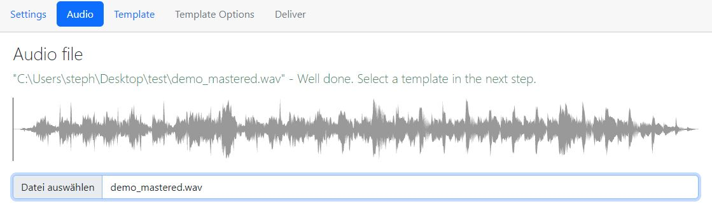
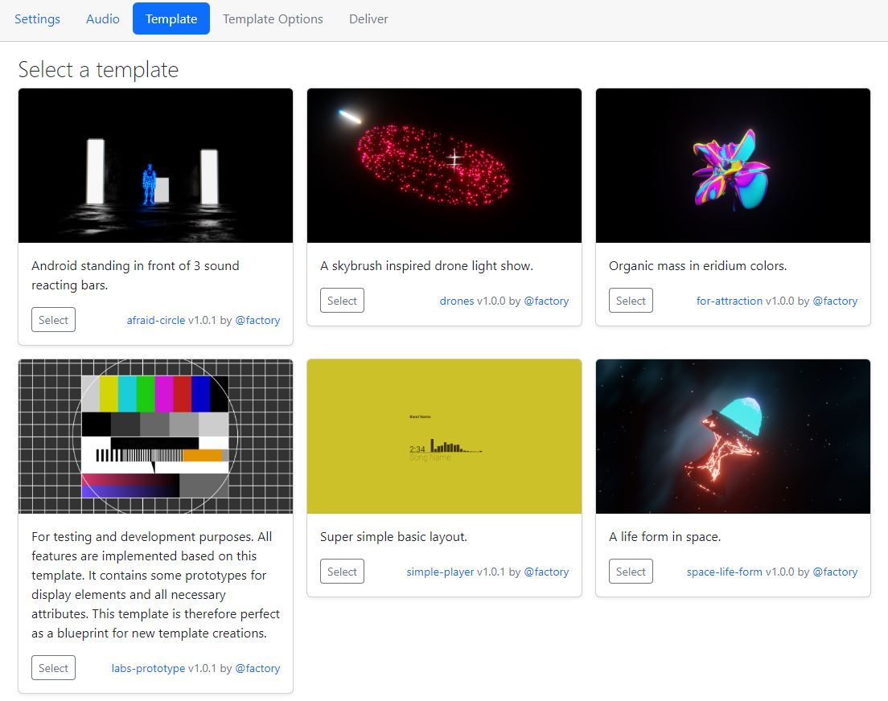

# Sonic Sound Picture | Music/Audio Visualizer Software


Sonic Sound Picture (SSP) Cross platform Music Visualizer Software based on Blender 

## Links

- [Download](https://github.com/s-a/sonic-sound-picture/releases) 
- [Join the discord server](https://discord.com/invite/MaKtp6jx3T) 

### Workflow


#### 1. Select Audio 



#### 2. Select a template 



#### 3. Template configuration


#### 4. Deliver video file


## Create new templates 

If you create and new template your are invited to share it with community or at least a showcase on our discord server. I am very excited to see what a real blender artist could do with this software 🤙. 

### Blueprint Showcase


### Add a new fresh template blend file

Open the blueprint from `...\templates\@factory\labs-prototype\template.blend` (Hover over template image in GUI to inspect the path on your system). Either remove not needed objects or create a new blend file and copy the `empty` `SONIC_SOUND_PICTURE_DATA_STORAGE`. This `empty` is very important because it holds the need `custom properties` to automate the audio dynamics for visualisation.
Save the file in your own creator name namespace folder for example `@john-doe`. There your need to create a own folder for each template you whish to create for example `my-cool-template`. All at `C:\Users\...\AppData\Roaming\ssp\templates` (there is a shortcut to the folder in GUI main menu ) 
For example `C:\Users\...\AppData\Roaming\ssp\templates\@john-doe\my-cool-template`

Each template folder  needs 3 files to be valid.
- template.blend (Blender template file)
- template.json (Template configuration)
- template.png (480x270 Template preview for SSP GUI)

### Automation basics

The `empty` `SONIC_SOUND_PICTURE_DATA_STORAGE` contains already `custom properties`. There are also `custom properties` to visualize the frequency bands. 
You can create up to 12 bands. All these properties will be automated by SSP software (bands in range from `0` to `1`). The simple magic behind all this stuff is to bind a driver to any object you can imagine in blender. Scale.Z or color emission strength. You name it. 

#### Automated Properties

These properties will be automated before rendering process but you can play around with theses values while template creation process.

| Name | Range | Type | Description |
| ---- | ----- | ---- | ----------- |
| scene_fps | between 24 and 60 | Constant | (internal use) needed to sync computation of effects in sync between beats per minute of a song and the frames per second of a video |
| song_beat_id | 1-4 | Variable | Beat counter in sync with a song |
| song_bpm | 0-n | Constant | The beats per minute of a song |
| song_frequency_band_00 | 0-1 | Variable | The amplitude value of a frequency spectrum range in relation of values between `0` and `1`. You can create up to 12 bands `..._band_00` to `..._band_11`. SSP software will split up the audio frequency ranges evenly between available bands in your template |
| song_impulse | 0-1 | Variable | Song impulse pulsing in a time range of one bar from `0` to `1` |
| song_length_seconds | 0-n | Variable | Song length in seconds |
| song_progress | 0-1 | Variable | Song Progress |
| song_section_id | 0-n | Variable | Song section detected by SSP software where each section describes a specific within a song represented by a number. For example intro, chorus, verse, outro etc. |


### Template configuration definition

`template.json` schema is defined as follows.

#### template.json properties

| Key | Description |
| --- | ----------- |
| version | your template file version |
| minBlenderVersion | minimal required blender version (needed if you use edge brand new blender functions only available in newer versions.) |
| allowCompositionNode | determines if the user is allowed to activate the composition node of the blend file while rendering |
| allowTransparent | determines if the user is allowed to render the video with a transparent background |
| description | a short description of your template |
| parms | the parameter collection you want to provide |

#### Custom template parameters

In your template configuration you can also add custom properties which can be changed by the user while template configuration (see ***step 3 of workflow***) For example colors, texts, images, logos etc. Each of theses custom properties become a `parms` object within your new `template.json`

A `parms` schema is defined as follows.

| Key | Description |
| --- | ----------- |
| type | (text \| file \| color) defines the type if input for the user |
| title | defines title of input |
| value | defines default value of the input |
| path | defines the blender path selector to object within the blend file |

Each path can be easy observed with a blender context menu (Copy Full Data Path). 


#### template.json example

```javascript
{
	"version": "1.0.1",
	"minBlenderVersion": "3.4.1",
	"allowCompositionNode": false,
	"allowTransparent": true,
	"description": "For testing and development purposes. All features are implemented based on this template. It contains some prototypes for display elements and all necessary attributes.  This template is therefore perfect as a blueprint for new template creations.",
	"parms": [
		{
			"type": "text",
			"title": "Songname",
			"value": "",
			"path": "bpy.data.objects[\"Text.004\"].modifiers[\"GeometryNodes\"][\"Input_2\"]"
		},
		{
			"type": "file",
			"title": "Image",
			"accept": "image/png, image/gif, image/jpeg",
			"path": "bpy.data.images[\"000013.1769220830.png\"].filepath"
		},
		{
			"type": "color",
			"title": "Color",
			"value": "#ff00ff",
			"path": "bpy.data.materials[\"Material.001\"].node_tree.nodes[\"Emission\"].inputs[0].default_value"
		}
	]
}
```

After All these steps are done your new template apers at ***step 2 workflow (select template)***

### Template Example showcases

More at our Discord Server...

#### Afraid Circle


#### For Attraction 


#### Drones


#### Davinci Resolve Transparent Video useful for Podcasts

